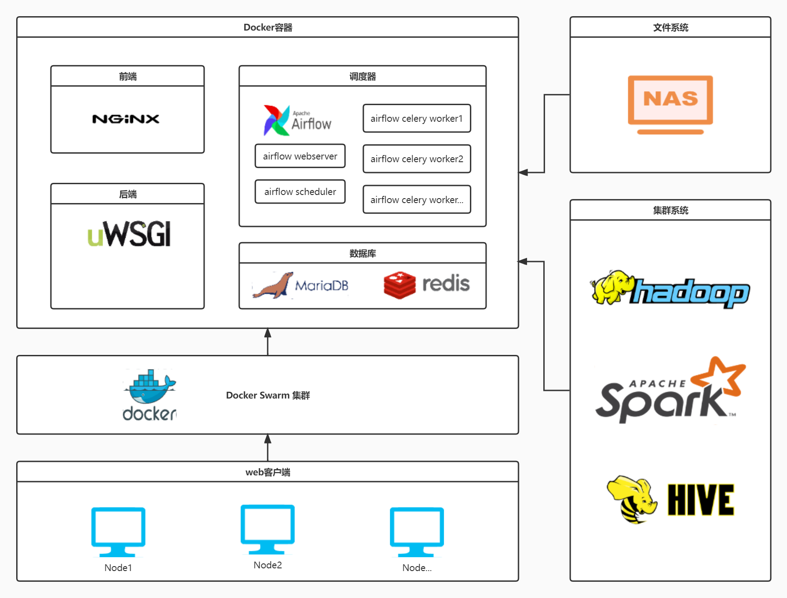

# xx机器学习平台
简体中文 | [English](README_EN.md)

## 项目产出
- 一体式算法应用平台，提供从数据上传，清洗，处理，探索，建模，部署等全流程功能
- 提供拖拽式的画布建模功能
- 提供NoteBook手动编写算法并存储的功能
- 提供任务调度功能供离线、在线调度进行预测
- 针对单机、分布式数据各自提供独立的全部功能

## 功能列表
- 数据管理
  - 数据添加，删除，预览，更名等
  - 文件夹创建和数据管理
- 数据探索
  - 数据、特征ETL
  - 可视化
- 建模实验
  - 0代码拖拽式画布，完成建模预测全流程
  - 单机画布、分布式画布
  - 包括特征工程、分类模型、预测模型、分组模型、深度学习等
- 模型管理
  - 画布中完成的模型进行保存，查看其流程Pipeline、效果、参数、使用特征等
  - 手动预测和批量调度
- 算法管理
  - 用户上传或编写的代码保存，并在之后的画布中使用
- 任务中心
  - 管理调度任务。支持上下线、删除、查看关联模型等
- 用户管理
  - 管理员进行用户分组，权限控制
  - 普通用户进行用户名，密码修改等操作

## 部署框架
- 

## 代码架构
- 后端基于Django框架，各组件独立实现各自功能，互相解耦
- 算法相关代码独立于应用框架外，方便Airflow进行调度
- 各组件设置独立的ops、service、utils功能，以及共同使用的common功能
- 通过中间件Middleware进行访问控制，日志控制等
- 画布使用DAG构图，Airflow调度

## 算法能力
- 特征处理
  - 数据、特征ETL
  - 仿Excel的公式计算
  - 年龄等信息提取
  - 自动化分箱等
- 可视化
- 机器学习
  - 回归模型
    - ElasticNet
    - GBDT
    - ......
  - 分类模型
    - SVM
    - Logistic Regression
    - Xgboost
    - ......
  - 分组模型
    - K-means
    - DBSCAN
    - ......
- 深度学习
  - CNN
  - LSTM
  - DeepFM
  - ......
- 时间序列
  - Arima
- 模型融合
  - StackingClassifier
  - AverageVoting
  - ......

## 技术能力
- 前端使用Uwsgi+nginx进行流量分配
- 后端使用Django框架+MariaDB+Airflow调度
- 使用Docker Swarm容器化部署，多节点执行
- 算法方面单机Sklearn+分布式MLLIB

## 我的角色
- 单机/分布式产品融合负责人，将分布式产品从传统的DAAS部署转换为轻量级产品部署
- 深度学习、时间序列算法开发
- 数据、探索、模型等组件代码重构负责人
- 部分重要客户交付负责人

## 备注
- 代码为部门商业机密，此项目仅提供框架示例和介绍，实际代码个人未保存
- 欢迎联系[Bowen Li](https://crazybruce-bowen.github.io/) 获取更多信息